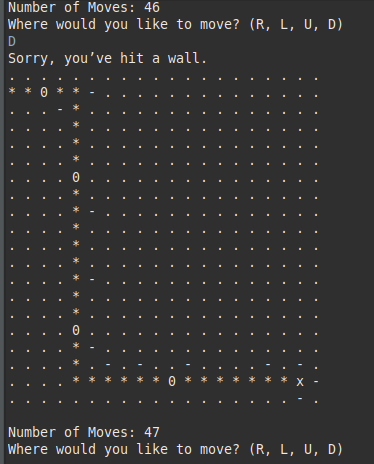

## Java project MazeRunner

Player find the way out of a maze with a limitation of steps. The maze is build with wall and pits. Whenever the player hits the wall, he has to change his direction which is one option of Right, Left, Up or Down. If the player meets a pit, he has to jumps.     

    
    
An example of the game. 

## Reference 
Edx: Learn to Program in Java
